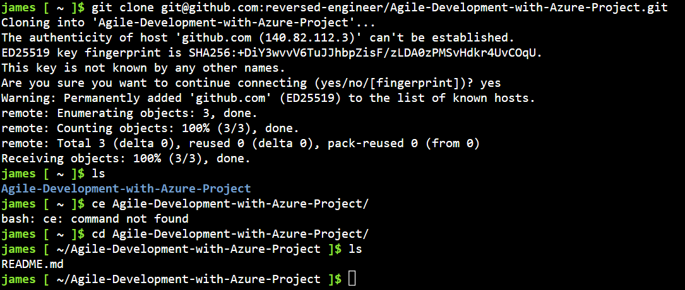
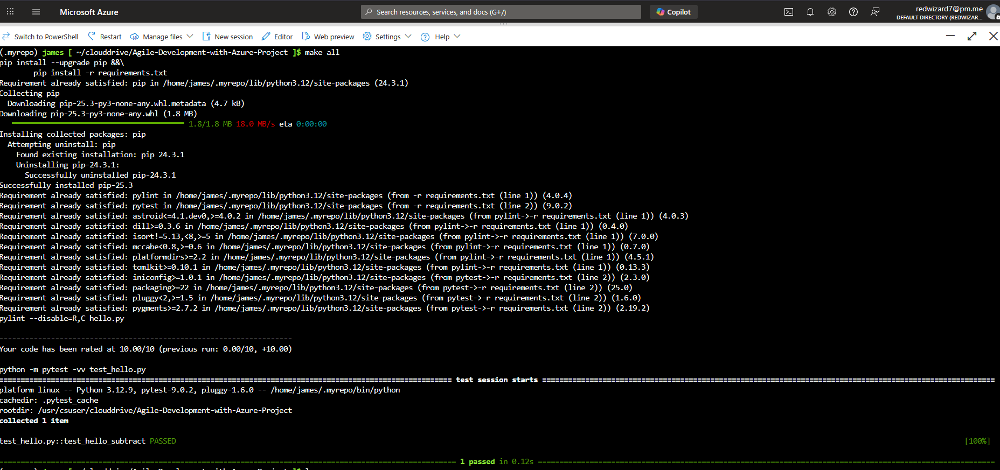
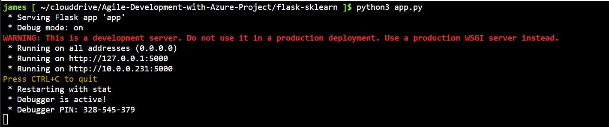
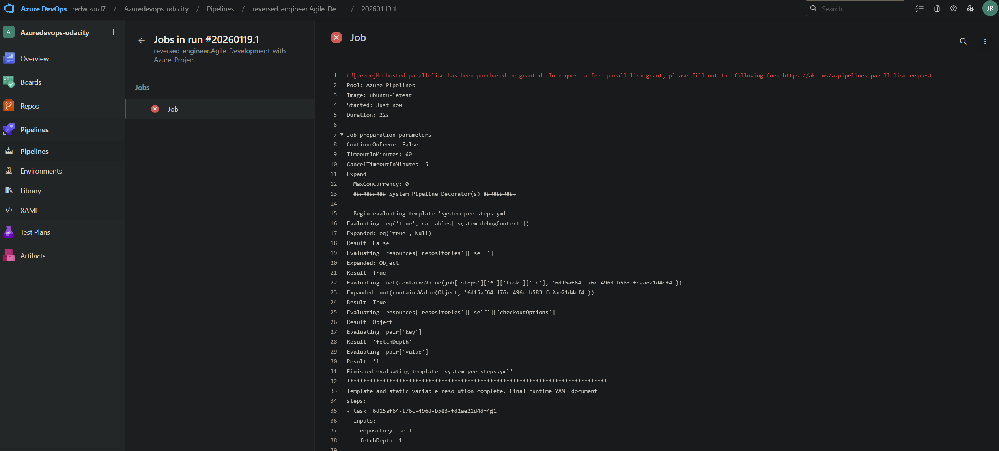
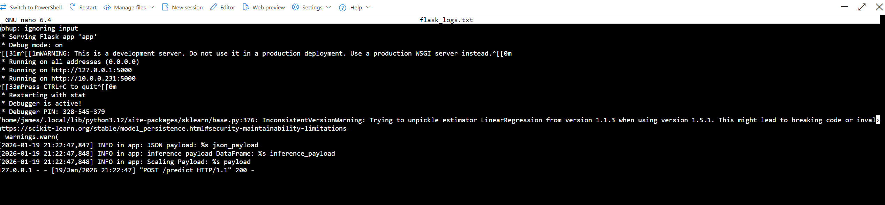

# Agile Development with Azure Project

## Overview

This project demonstrates Continuous Integration (CI) and Continuous Delivery (CD) using Azure DevOps and Azure App Services.  
It includes a Flask-based machine learning API for predicting housing prices using pre-trained models.  
The project shows how to automate testing, deployment, and prediction using Azure Cloud Shell, Azure Pipelines, and GitHub.

---

## Project Plan

- Trello Board: [Link to Trello Board](#)  
- Project Plan Spreadsheet: [Link to Spreadsheet](#)

---

## Instructions

### 1. Clone the Project into Azure Cloud Shell
The repository is cloned into Azure Cloud Shell for development and testing.

  
*Figure 1: Project cloned into Azure Cloud Shell*

---

### 2. Install Dependencies and Run Tests
After cloning, install the required Python packages and run tests with `make all`.

  
*Figure 2: All tests passing after running `make all`*

---

### 3. Run the Flask App
Start the Flask API locally to ensure it runs correctly.

  
*Figure 3: Flask API running locally in Azure Cloud Shell*

---

### 4. Make Predictions Locally
Test the API with the provided prediction script.

  
*Figure 4: Sample prediction output from the Flask API*

---

### 5. Continuous Integration / Continuous Deployment
The project is deployed automatically using Azure Pipelines.  
The pipeline builds, tests, and deploys the Flask API to Azure App Service.

  
*Figure 5: Azure Pipeline successfully building, testing, and deploying the project*

---

### 6. Monitor Logs
View the running Flask app logs in Azure Cloud Shell.

  
*Figure 6: Streamed logs from the running Flask API*

---

## Demo

Watch a screencast demonstrating all key steps of the project:  
[YouTube Demo Video](#)

